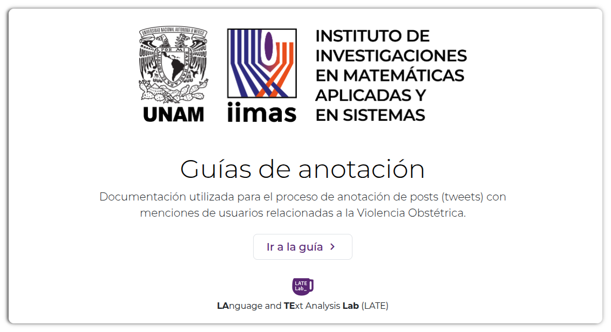

# obstetric-violence-tweets

## Guías de anotación
Documentación utilizada para el proceso de anotación manual para identificar tweets relacionados con Violencia Obstétrica.

## Palabras clave
Palabras clave utilizadas para el identificar tweets con menciones sobre Violencia Obstétrica

<table>
    <thead>
        <tr>
            <th>No.</th>
            <th>Palabras</th>
            <th>Expresión Regular Utilizada</th>
        </tr>
    </thead>
    <tbody>
        <tr><td> 1</td><td>violencia obstétrica                      </td><td><code>violen[cs]ia\s?obst[é|e]trica</code></td></tr>
        <tr><td> 2</td><td>VO                                        </td><td> <code>\#VO\b</code </td></tr>
        <tr><td> 3</td><td>parir                                     </td><td> <code>\bparir\b</code> </td></tr>
        <tr><td> 4</td><td>trabajodeparto                            </td><td> <code>trabajodeparto</code> </td></tr>
        <tr><td> 5</td><td>trabajos de Parto                         </td><td> <code>trabajos?\s?(de)?\s?\bParto\b</code> </td></tr>
        <tr><td> 6</td><td>cuello Utero                              </td><td> <code>cuello .*\bUtero\b</code> </td></tr>
        <tr><td> 7</td><td>cuellodelutero                            </td><td> <code>cuellodelutero</code> </td></tr>
        <tr><td> 8</td><td>cesárea innecesaria                       </td><td> <code>ces[á|a]r[e|i|í]as?\s?inn?ecesarias?</code> </td></tr>
        <tr><td> 9</td><td>cesárea programada                        </td><td> <code>ces[á|a]r[e|i|í]a\s?programada</code> </td></tr>
        <tr><td>10</td><td>centimetros dilatación                    </td><td> <code>cent[í|i]metros.*\s?dilataci[o|ó]n</code> </td></tr>
        <tr><td>11</td><td>desgarre Cervix                           </td><td> <code>desgarre.*Cervix</code> </td></tr>
        <tr><td>12</td><td>episiotomía                               </td><td> <code>episiotom[í|i]a</code> </td></tr>
        <tr><td>13</td><td>stopkristeller                            </td><td> <code>stopkristeller</code> </td></tr>
        <tr><td>14</td><td>maniobra kristeller                       </td><td> <code>maniobra.*\s?[kc]ristell?er</code> </td></tr>
        <tr><td>15</td><td>Kristeller                                </td><td> <code>[K|c]ristell?er</code> </td></tr>
        <tr><td>16</td><td>complicación en el embarazo               </td><td> <code>complicaci[ó|o]n\s?(en|en el)\s?emba?razo</code> </td></tr>
        <tr><td>17</td><td>complicación en el parto                  </td><td> <code>complicaci[ó|o]n\s?(en|en el)?\s?parto</code> </td></tr>
        <tr><td>18</td><td>complicación cesárea                      </td><td> <code>complicaci[ó|o]n.*Ces[á|a]rea</code> </td></tr>
        <tr><td>19</td><td>discriminación Edad                       </td><td> <code>discriminaci[ó|o]n\s?.*\bEdad\b</code> </td></tr>
        <tr><td>20</td><td>discriminación sobrepeso                  </td><td> <code>discriminaci[ó|o]n.*sobrepeso</code> </td></tr>
        <tr><td>21</td><td>esterilización forzada                    </td><td> <code>esterilizaci[ó|o]n forzada</code> </td></tr>
        <tr><td>22</td><td>sufrimiento fetal                         </td><td> <code>\b(sufrimiento\s?fetal)\b</code> </td></tr>
        <tr><td>23</td><td>parto Inducido                            </td><td> <code>parto\s?Inducido</code> </td></tr>
        <tr><td>24</td><td>tactos vaginales                          </td><td> <code>tactos\s?Vaginales</code> </td></tr>
        <tr><td>25</td><td>falta Intimidad                           </td><td> <code>falta\s?.*Intimidad</code> </td></tr>
        <tr><td>26</td><td>acelerar el parto                         </td><td> <code>acelerar\s?el?\s?parto</code> </td></tr>
        <tr><td>27</td><td>oxitocina sintética                       </td><td> <code>oxitocina\s?sint[e|é]tica</code> </td></tr>
        <tr><td>28</td><td>comentarios Irónicos                      </td><td> <code>comentarios\s?Ir[ó|o]nicos</code> </td></tr>
        <tr><td>29</td><td>trato deshumanizado                       </td><td> <code>trato\s?.*deshumanizado</code> </td></tr>
        <tr><td>30</td><td>anestesia epidural                        </td><td> <code>anestesia\s?epidural</code> </td></tr>
        <tr><td>31</td><td>ruptura de membranas                      </td><td> <code>ruptura\s?de?\s?membranas</code> </td></tr>
        <tr><td>32</td><td>anestesia general innecesaria             </td><td> <code>aneste[c|s]ia\s?general\s?inn?ecesaria</code> </td></tr>
        <tr><td>33</td><td>castigo por quejarme                      </td><td> <code>castigo\s?por\s?quejarme</code> </td></tr>
        <tr><td>34</td><td>Castigo por gritar                        </td><td> <code>castigo\s?por\s?gritar</code> </td></tr>
        <tr><td>35</td><td>regaños del médico                        </td><td> <code>regaños\s?del\s?m[é|e]dico</code> </td></tr>
        <tr><td>36</td><td>sentirme ignorada por el médico           </td><td> <code>sentirme\s?ignorada\s?por\s?el\s?m[é|e]dico</code> </td></tr>
        <tr><td>37</td><td>separación del bebé                       </td><td> <code>separaci[ó|o]n\s?del\s?beb[é|e]</code> </td></tr>
        <tr><td>38</td><td>apego inmediato del bebé                  </td><td> <code>apego\s?inmediato\s?del\s?beb[é|e]</code> </td></tr>
        <tr><td>39</td><td>hemorragia Parto                          </td><td> <code>hemorragia\s?.*Parto</code> </td></tr>
        <tr><td>40</td><td>falta de consentimiento informado         </td><td> <code>falta\s?de\s?consentimiento\s?informado</code> </td></tr>
        <tr><td>41</td><td>ignorar mi dolor                          </td><td> <code>ignorar\s?(mi|el)?\s?dolor</code> </td></tr>
        <tr><td>42</td><td>ejercicios de medicos residentes          </td><td> <code>ejercicios\s?m[é|e]dicos\s?residentes</code> </td></tr>
        <tr><td>43</td><td>ejercicios de estudiantes de medicina     </td><td> <code>ejercicios\s?de\s?estudiantes\s?de\s?medicina</code> </td></tr>
        <tr><td>44</td><td>intervención médica innecesaria           </td><td> <code>intervenci[ó|o]n\s?m[é|e]dica\s?inn?ecesaria</code> </td></tr>
        <tr><td>45</td><td>no permitir el apego inmediato madre bebé </td><td> <code>no\s?permitir\s?el\s?apego\s?inmediato\s?.*madre\s?.*bebé</code> </td></tr>
        <tr><td>46</td><td>parto humanizado                          </td><td> <code>parto\s?humanizado</code> </td></tr>
        <tr><td>47</td><td>parto Respetado                           </td><td> <code>parto\s?Respetado</code> </td></tr>
        <tr><td>48</td><td>parteras                                  </td><td> <code>parteras</code> </td></tr>
        <tr><td>49</td><td>doulas                                    </td><td> <code>doulas</code> </td></tr>
        <tr><td>50</td><td>trato grosero médico                      </td><td> <code>trato\s?grosero\s?.*m[é|e]dico</code> </td></tr>
        <tr><td>51</td><td>sufrimiento innecesario                   </td><td> <code>sufrimiento\s?inn?ecesario</code> </td></tr>
        <tr><td>52</td><td>alarma obstétrica                         </td><td> <code>alarma\s?obst[é|e]trica</code> </td></tr>
        <tr><td>53</td><td>hemorragia obstétrica                     </td><td> <code>hemorragia obst[e|é]trica</code> </td></tr>
        </tr>
    </tbody>
</table>
